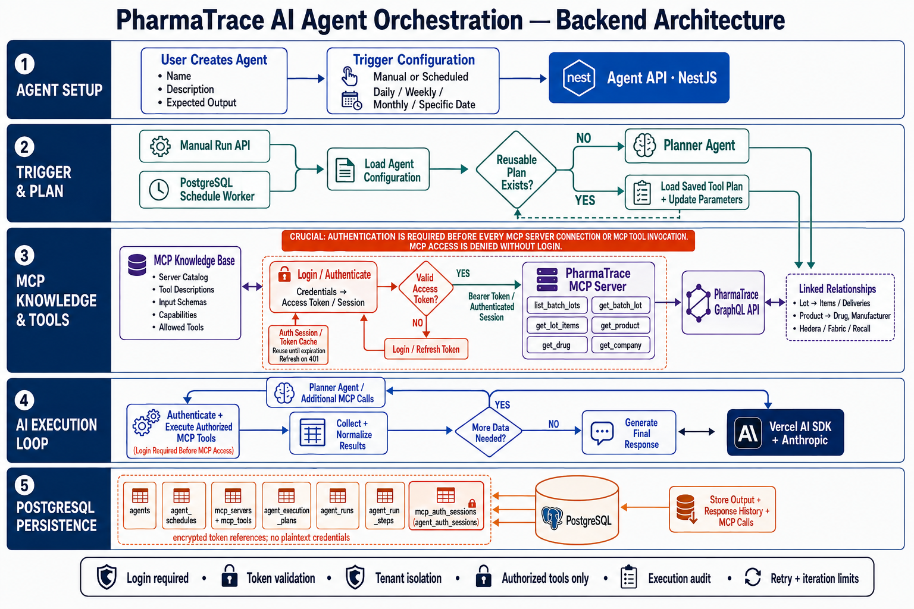
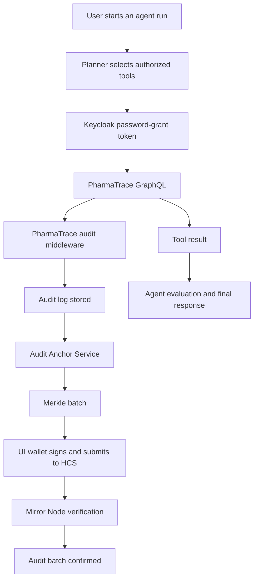

# PharmaTrace Agent Orchestrator

Backend-only NestJS service for running tenant-scoped AI agents against PharmaTrace GraphQL data.
The service supports OpenAI, Anthropic, and local Ollama models, Keycloak authentication, MCP tool
execution, PostgreSQL run history, reusable plans, and scheduled execution.




## What the service does



There are two kinds of records:

- `agent_runs` and `agent_run_steps` are orchestrator execution history.
- PharmaTrace audit logs are created by the GraphQL/API audit middleware. The orchestrator does not
  insert those records directly.

For the PharmaTrace audit log to contain an agent request, the GraphQL call must use the correct
Keycloak token and the same `tenantid` value used by the UI.

## Supported providers

- `OPENAI`: hosted OpenAI models.
- `ANTHROPIC`: hosted Claude models.
- `OLLAMA`: local or private Ollama through its OpenAI-compatible API.

Recommended local model:

```text
qwen2.5-coder:7b-instruct
```

It should be installed in the Ollama instance reachable by the orchestrator and must support tool
calling. Smaller models may be useful for local testing but can fail to invoke tools or return
structured output reliably.

## PharmaTrace tools

The default six-tool catalog is:

| Tool | Purpose |
|---|---|
| `list_batch_lots` | List lots with pagination. |
| `get_batch_lot` | Get one lot and its anchor/recall information. |
| `get_lot_items` | Get items, deliveries, and containers for one lot. |
| `get_product` | Get product details and its drug reference. |
| `get_drug` | Get drug details and identifiers. |
| `get_company` | Get company or manufacturing-site details. |

The agent may call several tools, but only tools in its allowlist can execute. `maxToolCalls` and
`maxIterations` limit actual execution. A planner may describe several possible steps, but only
completed MCP calls appear in the run tool-call history.

## Tenant and identity rules

Every protected orchestrator request requires:

- `x-tenant-id`: tenant UUID used to scope connections, servers, agents, and runs.
- `x-user-id`: UUID recorded as the caller who created or triggered the resource.
- `x-service-api-key`: required when `SERVICE_API_KEY` is configured.

The orchestrator currently reads tenant and user identity from these headers; it does not extract
them from a Keycloak JWT. The GraphQL request forwards the tenant as `tenantid`.

Use the same tenant ID as the UI if the agent activity must appear in the same PharmaTrace audit
tenant. Resources created under another tenant are not visible across tenants.

The backend Keycloak login uses:

- `KEYCLOAK_USERNAME`: the service user's `preferred_username`.
- `KEYCLOAK_PASSWORD`: that user's password.
- `KEYCLOAK_CLIENT_ID`: normally `api`.
- `KEYCLOAK_CLIENT_SECRET`: the secret for that client, when required.

The backend cannot read browser `localStorage`.

## Configuration

Start from `.env.example`. Important settings are:

| Variable | Purpose |
|---|---|
| `DATABASE_URL` | PostgreSQL connection. |
| `SERVICE_API_KEY` | Protects orchestrator APIs. |
| `PHARMATRACE_GRAPHQL_URL` | PharmaTrace GraphQL endpoint. |
| `KEYCLOAK_TOKEN_URL` | Keycloak token endpoint. |
| `KEYCLOAK_CLIENT_ID` | Keycloak client, normally `api`. |
| `KEYCLOAK_CLIENT_SECRET` | Keycloak client secret. |
| `KEYCLOAK_USERNAME` | Keycloak service username. |
| `KEYCLOAK_PASSWORD` | Keycloak service password. |
| `KEYCLOAK_GRANT_TYPE` | Usually `password`. |
| `OLLAMA_BASE_URL` | Ollama OpenAI-compatible endpoint. |
| `OLLAMA_API_KEY` | Placeholder such as `ollama` for local Ollama. |
| `MCP_REQUEST_TIMEOUT_MS` | Upstream request timeout. |
| `DEBUG_LLM_RESPONSES` | Temporary raw planner/evaluation/final-response logging. |
| `DEBUG_GRAPHQL_REQUESTS` | Temporary tenant/tool/request metadata logging. |

Never commit passwords, client secrets, API keys, or tokens. Use environment variables, Kubernetes
Secrets, mounted files, or a secret manager.

## Run locally

Prerequisites:

- Node.js 20.11 or newer.
- PostgreSQL.
- Ollama if using the local provider.
- `jq`, `curl`, and the required provider credentials.

Basic startup:

1. Copy `.env.example` to `.env` and fill in the required values.
2. Install dependencies with `npm install`.
3. Start PostgreSQL with the project Docker Compose setup.
4. Apply migrations with `npm run migrate`.
5. Start the service with `npm run start:dev`.
6. Check `GET /health`.

For Ollama, start Ollama and install the selected model before running an agent. The orchestrator
must be able to reach `OLLAMA_BASE_URL`; `127.0.0.1` is only correct when Ollama runs in the same
network namespace as the orchestrator.

## One-command test run

The script below syncs the MCP tools, creates a uniquely named agent, starts a manual run, waits for
completion, and prints the final result and tool calls:

```text
scripts/run-pharmatrace-agent.sh
```

Required environment values:

- `API`: orchestrator base URL, normally `http://localhost:3000/api/v1`.
- `SERVICE_API_KEY`: the same value configured by the orchestrator.

Optional values include `TENANT_ID`, `USER_ID`, `SERVER_ID`, `OLLAMA_CONNECTION_ID`, `MODEL`,
`MAX_ITERATIONS`, `MAX_TOOL_CALLS`, `PAGE`, `SIZE`, `AGENT_NAME`, and `QUERY`.

If `OLLAMA_CONNECTION_ID` is omitted, the script creates an Ollama connection at runtime using
`OLLAMA_API_KEY` and `OLLAMA_BASE_URL`. The backend itself must also have `OLLAMA_API_KEY` configured,
because the stored connection references the backend environment.

For a safe first test, use one iteration and one tool call. After that succeeds, increase the limits
for multi-tool execution.

## One-command lot anchoring run

Use this script after the backend has been configured with the Testnet signer, manager contract, and
Mirror Node settings. It verifies that the selected MCP server is the PharmaTrace GraphQL server,
synchronizes tools, discovers the current IDs for `list_batch_lots` and `push_lots_to_hedera`, creates
a manual Ollama agent, runs it, and prints the final pushed/skipped/failed lot results:

```text
scripts/run-pharmatrace-lot-anchor-agent.sh
```

Required values are `API`, `SERVICE_API_KEY`, and `SERVER_ID`. The backend runtime, not this script,
must contain `HEDERA_SIGNER_PRIVATE_KEY`, `HEDERA_RPC_URL`, and `PHARMATRACE_MANAGER_ADDRESS`.
Start with `SIZE=1` and `MAX_TOOL_CALLS=2`; increase them only after one lot succeeds.

## Normal execution flow

1. Create or select an LLM connection.
2. Register the PharmaTrace GraphQL server with password-grant Keycloak references.
3. Synchronize the six MCP tools.
4. Create an agent with an LLM connection, model, server allowlist, and tool allowlist.
5. Start a manual run or attach a schedule.
6. Monitor the run status and tool-call history.
7. Read the final response after the run reaches `COMPLETED`.

The run lifecycle is:

```text
QUEUED → PLANNING → EXECUTING → GENERATING → COMPLETED
                                      └──────→ FAILED
```

Each failed run is terminal. Start a new run after correcting configuration or code.

## Audit-log flow

The agent request is auditable only when all of the following are true:

1. Keycloak returns a valid access token.
2. The agent calls the correct PharmaTrace GraphQL endpoint.
3. The request includes the correct `tenantid` header.
4. The GraphQL/API audit middleware is enabled for that operation.

The orchestrator logs the tenant, tool, operation, endpoint, and request status when
`DEBUG_GRAPHQL_REQUESTS=true`. It never logs bearer tokens or passwords.

The audit anchoring flow is separate:

```text
PharmaTrace audit log
  → audit-anchor logs endpoint
  → wallet batch preparation
  → UI wallet signs HCS transaction
  → Mirror Node verification
  → CONFIRMED audit batch
```

## Scheduling

Agents support manual, scheduled, or both trigger modes. Supported schedules are daily, weekly,
monthly, and one-time. Schedules use IANA time zones and handle daylight-saving changes.

## Kubernetes deployment

Manifests are in `k8s/`. Configure database, provider credentials, Keycloak credentials, and service
API protection through Kubernetes Secrets. Set `OLLAMA_BASE_URL` to a reachable Ollama service name
when Ollama runs outside the orchestrator pod.

For multiple replicas:

- Use shared PostgreSQL.
- Use external or mounted secrets.
- Keep `SERVICE_API_KEY` identical across replicas.
- Do not rely on pod-local temporary storage for shared credentials.

## Main API groups

| Group | Purpose |
|---|---|
| `/health` | Service health. |
| `/llm/connections` | Provider connections and model tests. |
| `/mcp/servers` | PharmaTrace server registration and tool synchronization. |
| `/mcp/tools` | Synchronized MCP tool catalog. |
| `/agents` | Agent definitions and allowlists. |
| `/agents/:agentId/run` | Manual execution. |
| `/agents/:agentId/runs/:runId` | Run status and final result. |
| `/agents/:agentId/runs/:runId/tool-calls` | Actual MCP call history. |
| `/agents/:agentId/schedules` | Scheduled execution. |

All protected routes require the tenant and user headers described above.

## Troubleshooting

### HTTP 401 from the orchestrator

The `x-service-api-key` value does not match `SERVICE_API_KEY`, or the API URL is wrong. Use a plain
URL, not a Markdown link.

### Keycloak HTTP 401

Check the token URL realm, client ID, client secret, `preferred_username`, password, and password-grant
configuration. The orchestrator must be restarted after environment changes.

### GraphQL HTTP 400

The configured GraphQL document does not match the deployed schema. Compare it with the working UI
query and update the server's GraphQL document override.

### No PharmaTrace audit record

Check that the request used the UI tenant ID, the `tenantid` header was forwarded, and the upstream
audit middleware records that GraphQL operation. The orchestrator's `agent_run_steps` record is not
the same as a PharmaTrace audit-log record.

### The model returns text instead of calling tools

Use a tool-capable instruct model, verify that Ollama is reachable, and start with
`maxToolCalls=1`. Enable `DEBUG_LLM_RESPONSES=true` to inspect planner, execution, evaluation, and
final-response output.

## Development checks

```text
npm run typecheck
npm test
npm run build
```

Database migrations:

```text
npm run migrate
```

export API="http://localhost:3000/api/v1"
export SERVICE_API_KEY="rE+0oauVWo7MfpZ9hvtHLwn0zGVpNMYQkCW3QdPnPys="
export SERVER_ID="7a32537b-f586-4e76-a42a-d0e837d68d41"
export OLLAMA_API_KEY="ollama"
export SIZE=1

./scripts/run-pharmatrace-lot-anchor-agent.sh